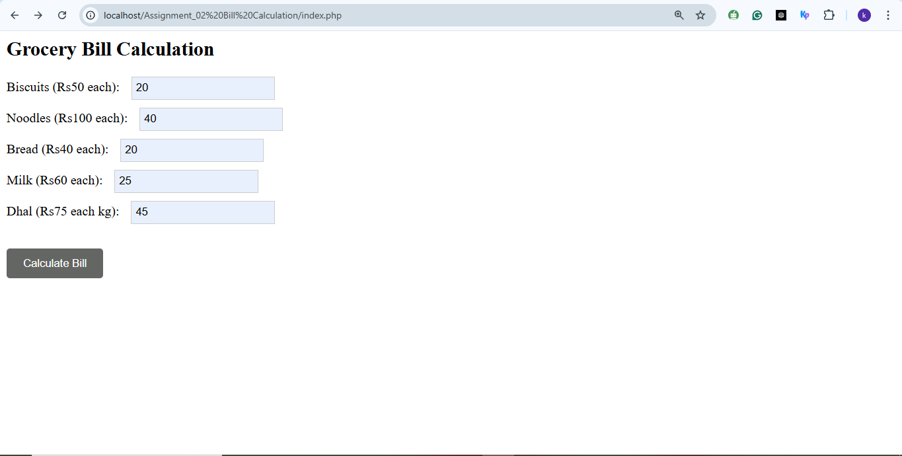
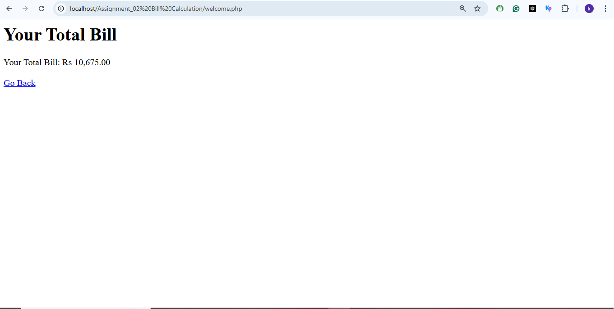

# Grocery Bill Calculation 🛒

This web app helps users easily calculate their total grocery bill. Enter the quantity for each item—Biscuits, Noodles, Bread, Milk, and Dhal—and click "Calculate Bill" to get the total. Each item has a fixed price, making it quick and simple to use.

## Features
- User-friendly form to add item quantities
- Calculates total bill instantly
- Fixed rates for each grocery item
- Built with PHP and HTML/CSS
  

