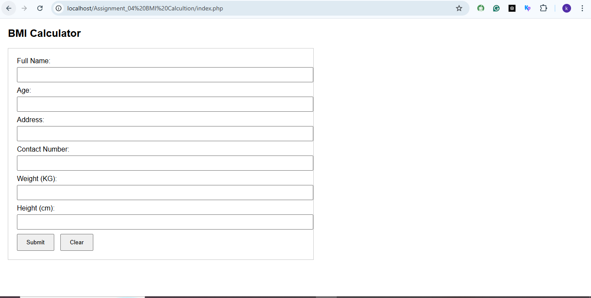

# ABC BMI Calculator ⚖

This project is a simple web-based BMI (Body Mass Index) calculator. Users can input their name, age, address, contact number, weight (in KG), and height (in cm). On submission, the app calculates the user's BMI and can display the result, helping users quickly check their health status.

## Features
- Clean and user-friendly input form
- Calculates BMI from weight and height
- Collects all basic personal details for better tracking
- Built using PHP and HTML
  

